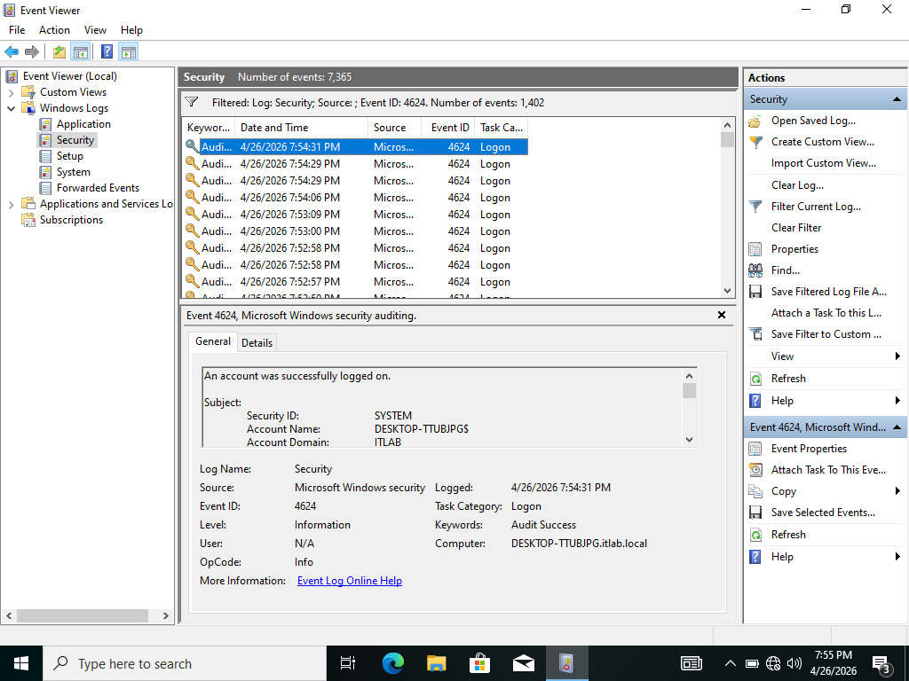
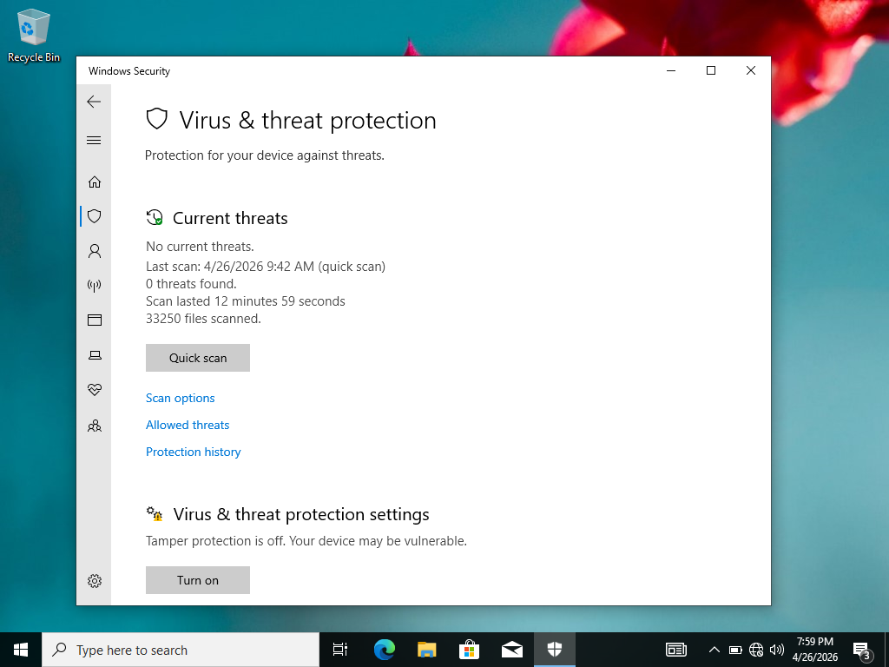
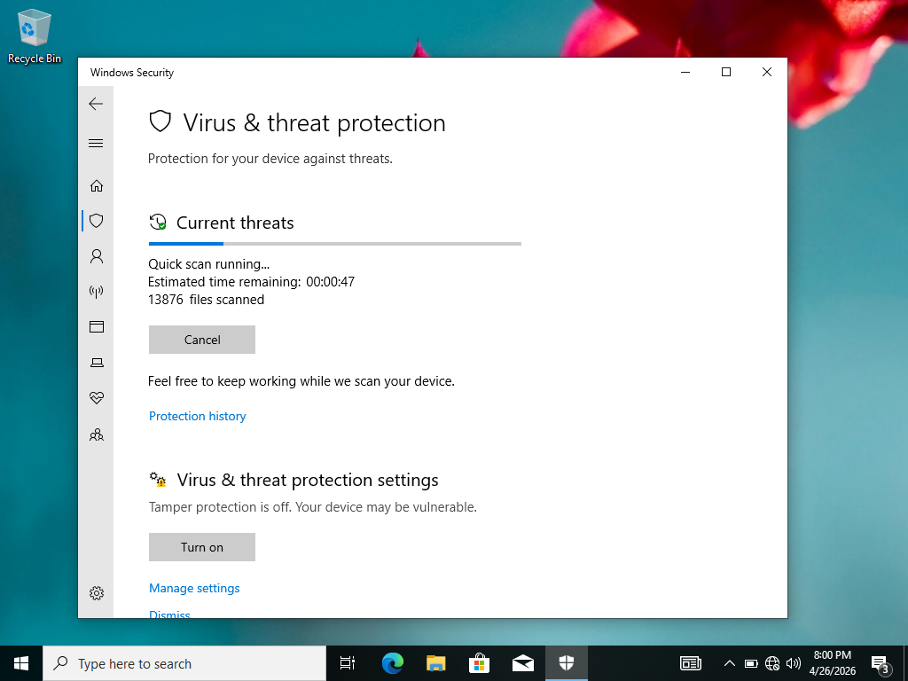
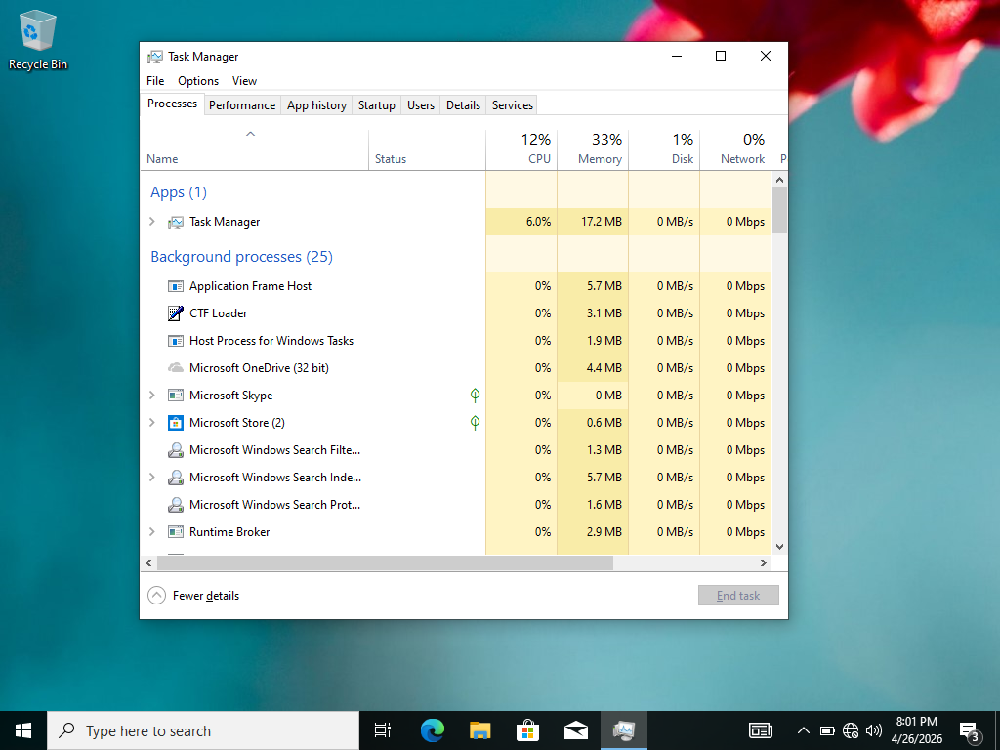
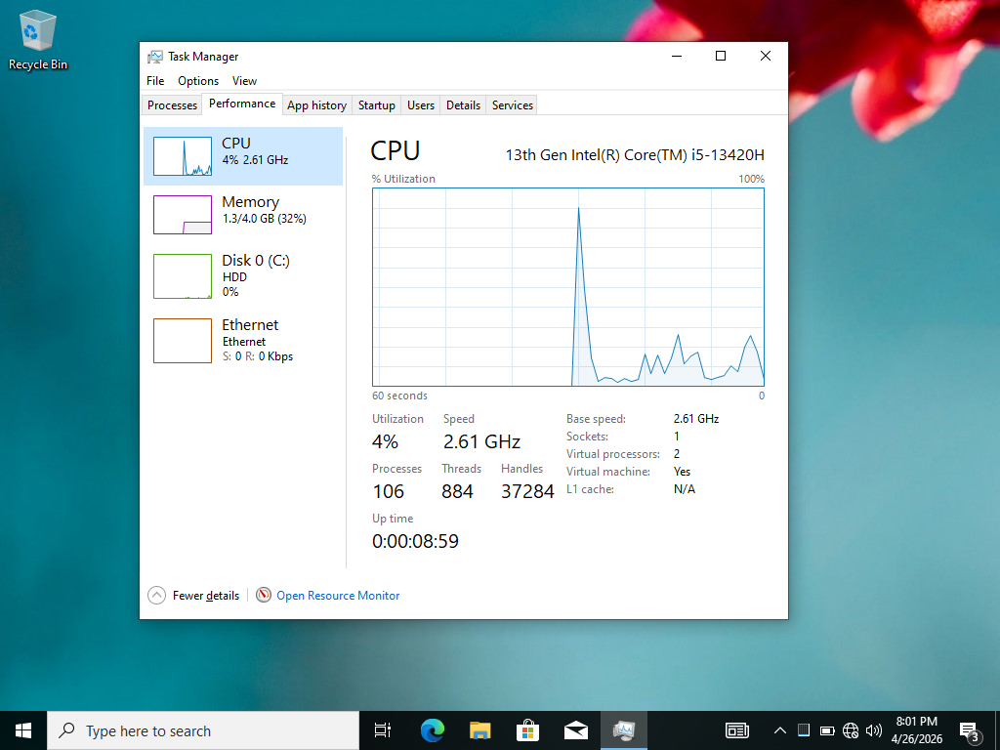
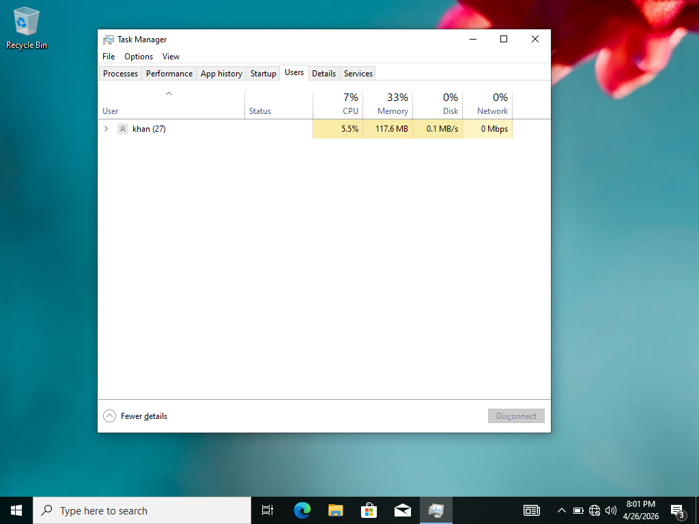
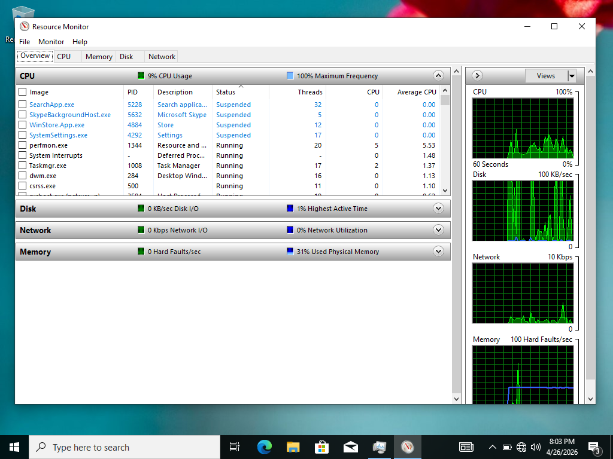
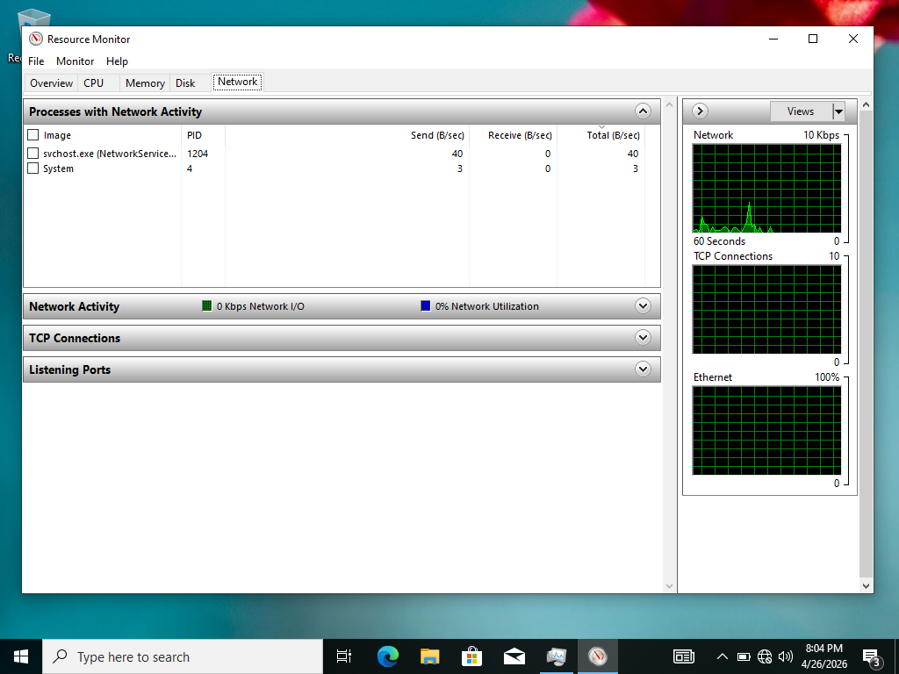
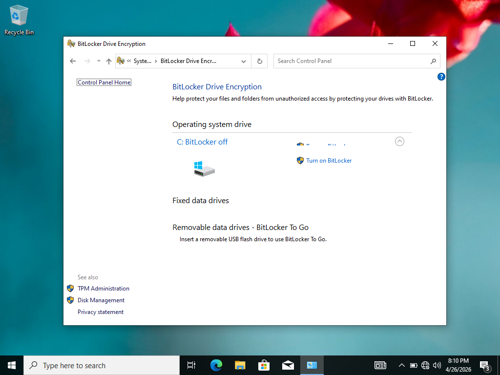

## ✅ What I Practiced
| Task | Status |
|------|--------|
| Event Viewer Security Logs | ✅ Done |
| Windows Defender Scan | ✅ Done |
| Task Manager Monitoring | ✅ Done |
| Resource Monitor | ✅ Done |
| BitLocker Encryption | ✅ Done |

---

## 📸 Screenshots

*1️⃣ Event Viewer — Security Log*

> Filtered security events using Event ID 4624
> showing successful domain user login attempts
> and timestamps for security auditing

---

*2️⃣ Windows Defender*

> Opened Windows Security center showing
> Virus & threat protection status and
> real-time protection enabled

---

*3️⃣ Defender Quick Scan*

> Ran Windows Defender Quick Scan showing
> scan results with no threats found
> on Windows 10 domain client machine

---

*4️⃣ Task Manager — Processes*

> Monitored all running processes showing
> CPU and memory usage for each application
> and background service

---

*5️⃣ Task Manager — Performance*

> Viewed real-time CPU, Memory and Disk
> performance graphs for system monitoring
> and troubleshooting

---

*6️⃣ Task Manager — Users*

> Users tab showing domain user Khan
> logged in with resource usage proving
> successful domain authentication

---

*7️⃣ Resource Monitor — Overview*

> Opened Resource Monitor showing detailed
> CPU, Disk, Network and Memory overview
> for advanced system monitoring

---

*8️⃣ Resource Monitor — Network*

> Network tab showing active connections
> and network activity between Windows 10
> client and Domain Controller

---

*9️⃣ BitLocker*

> Opened BitLocker Drive Encryption showing
> encryption options for drive security
> and data protection management

---

## 🎯 Skills Demonstrated
- Event Viewer & Security Log Analysis
- Windows Defender Antivirus Management
- Task Manager Process & Performance Monitoring
- Resource Monitor Advanced Diagnostics
- BitLocker Drive Encryption
- Windows 10 Domain Client Administration
